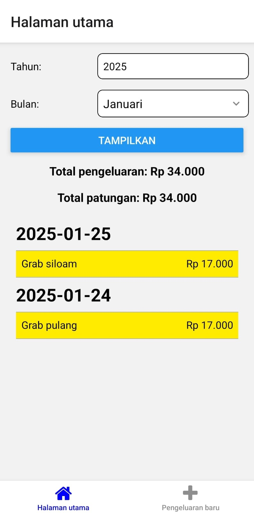
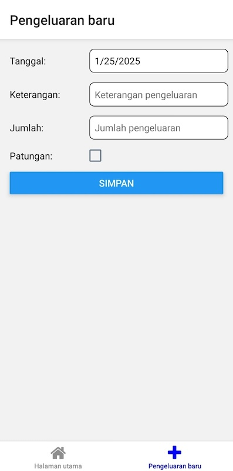
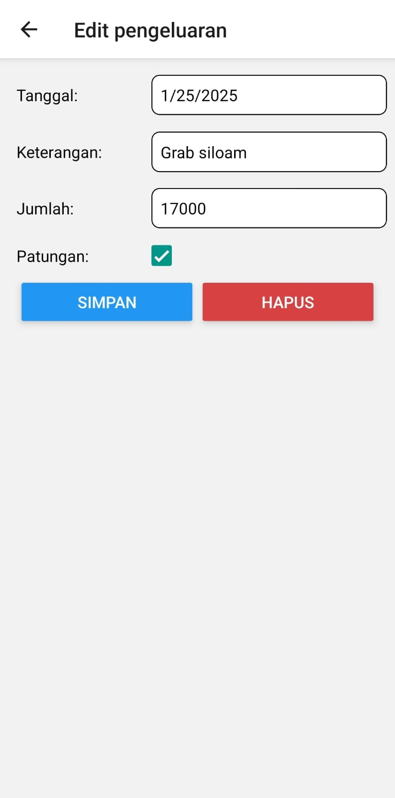

# simple-spendings-tracker

Simple spendings app made using [expo](https://www.expo.dev), made for my mother to track the family's monthly spending. Spendings data is stored using Google's Firestore.

Made for Android phone, so the information here may not be relevant for web or iOS development.

App icon is sourced from [freepik](https://www.freepik.com/icon/budget_781760).

## Setup

1. Download Expo Go on the play store, or install Android Studio and then configure emulators and SDKs.

2. Install dependencies

   ```bash
   npm install
   ```

3. Change Firebase credentials in `firebaseConfig.js` (and make sure Firestore & auth is enabled in the Firebase project)

4. Start the app

   ```bash
    npx expo start
   ```

## Building APK
Run `npm run build-android` and wait for the APK link to be done. APK file is hosted by expo.dev, but the link is not permanent.

## To-Do
- Infinite scroll instead of loading all spendings for a certain month
- Style the app better
- Implement dark mode
- Implement context for auth information
- Implement Google SSO
- Separate spendings collection by authenticated user

## Screenshots


*Home page*



*New spending page*



*Edit spending page*